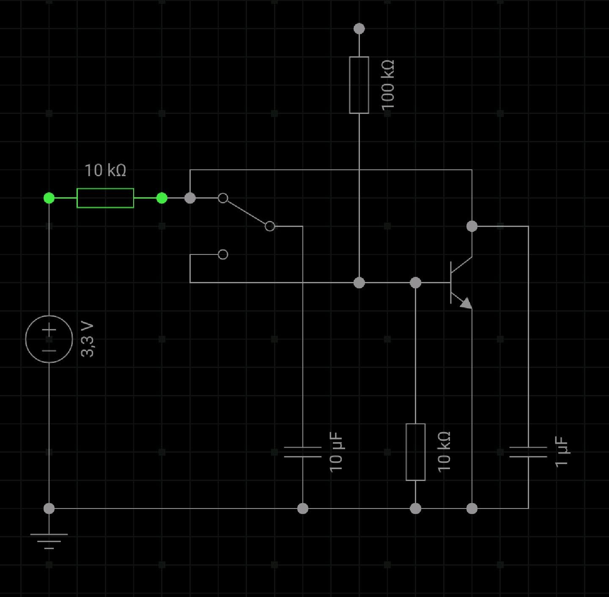

# ESPNow-Switch 
This is an attempt to create ultra-low power WiFi switches using ESPs.

Every ESP can be sent to deep-sleep, in which it consumes only a few µA until it is woken up by a low level signal on the reset pin.

# Overview
```
------------------------             ---------------
|                      |             |             |              ----------
|    Home Assistant    | <--WiFi-->  |   Master    |  <--ESPNow-- | Slave0 |  <---- [Reset Source]
|                      |             |             |              ----------
------------------------             ---------------
                                             ^                    ----------
                                             |---------- ESPNow-- | Slave1 |  <---- [Reset Source]
                                                                  ----------
                               ...

                                             ^                    ----------
                                             |---------- ESPNow-- | SlaveN |  <---- [Reset Source]
                                                                  ----------
```
# Reset Sources
## Timer
## Toggle Switch
For this variant it is easy to achieve the wake-up signal. Just use an SPDT switch and connect ground to the input and the reset pin to the the NO (normally open) output of the. Releasing the switch will now wake up the ESP from deep-sleep. Alternatively connect it to NC if you want to trigger the reset whenever the switch is pressed. The state is saved in EEPROM so that it can be toggled after reset.

## Two-Way Switch (e.g. for window/door sensors)

This variant is supposed to change its state on every change of the switch position. For this we need to again generate a low level signal on the reset pin. The problem is: how do we do that?

1. Solutions all over the internet ... use two XOR gates ... no thanks I don't want to have 10 mA idle current.
2. Use two switches ... ok, this can work but might not be applicable 
3. Make use of the following circuit, where the reset pin is connected to the first input of the switch
[Interactive circuit](https://everycircuit.com/circuit/6615683099787264)



### State On:
The capacitor (C1) on the right is being charged. There will be only a peak current in the beginning, until C1 is saturated.
The other capacitor (C2) is being discharged via the base current of the transistor, connecting the reset to ground for as long as C2 is charged. 

### State Off:
C2, which is ten times bigger than C1, is suddenly connected to C1. Since the 10kOhm resistor limits the current, C1 will be discharged which leads to a voltage drop that resets the ESP.

## On-Off using two switches (e.g. MailBox sensor)
This variant uses two SPDT switches, one to watch the front lid, the other one for the back.
The front lid can be opened as many times as wanted, but will only change the state once until reset.
Opening the back lid will reset the state. To achieve this we can use a slightly modified version of the Two-Way Switch. Instead of connecting the second input of the switch to a transistor, it is connected to ground over a resistor (1k). Pin 3 of the ESP is used to detect, whether the front or the back was opened.

ToDo: add image of the circuitry and flags to the code.

# Prerequisites
[Home Assistant](https://www.home-assistant.io/) installation with [ESPHome Integration](https://esphome.io/) enabled.

# Configuration
In src/main.cpp put the mac address of your master and the channel your WiFi is operating on. It will not work, if your WiFi uses a different channel than ESPNow. So make sure it is fixed in your router.

In esp_switch.yaml register the slaves with their mac address and set the rest, like WiFi etc.

The master will be automatically discovered via [ESPHome Integration](https://esphome.io/).

# How to build:
## Slaves

```
platformio run --environment esp01_1m
```

## Master
```
first run:
docker run --rm -v <Path_to_ESPNow-Switch>:/config -it esphome/esphome esp_switch.yaml --device=/dev/ttyUSB0 run
every other:
docker run --rm -v <Path_to_ESPNow-Switch>:/config -it esphome/esphome esp_switch.yaml run --upload-port espnow-switch
```

# Links and kudos

https://github.com/esphome/esphome

https://www.home-assistant.io/

https://docs.espressif.com/projects/esp8266-rtos-sdk/en/latest/get-started/index.html
